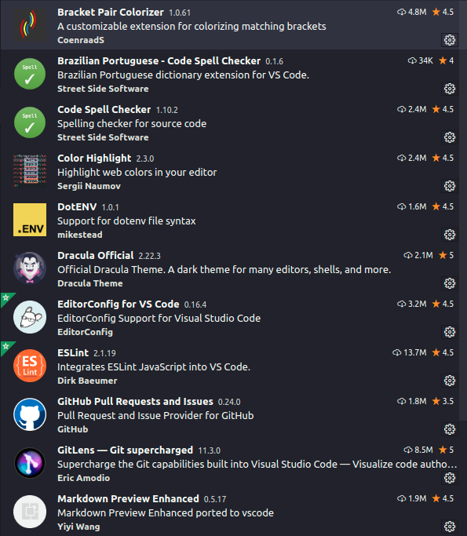
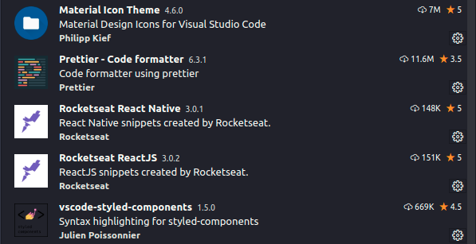
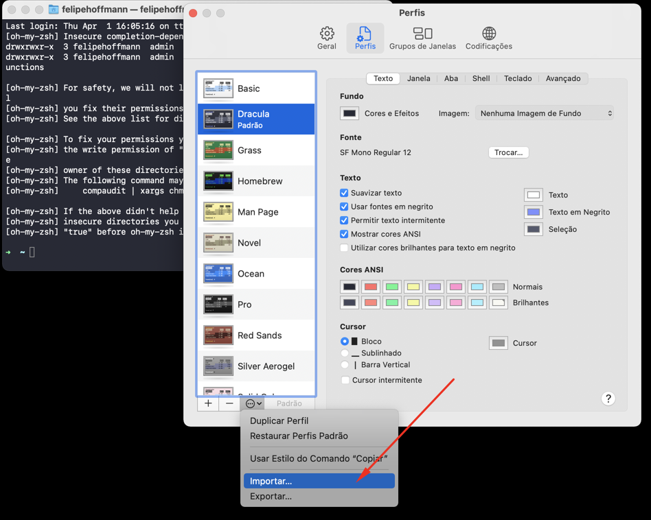
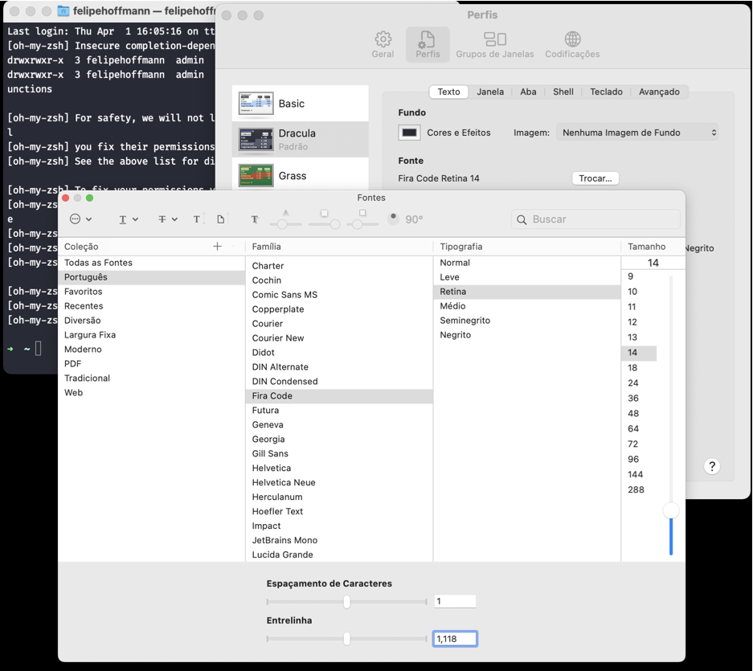

# Ambiente de desenvolvimento NodeJS, React, React Native

- [Ambiente geral](#ambinete-geral)
    - [Softwares](#softwares-geral)
        - [VSCode](#vscode)
- [React Native](#react-native)
    - [Softwares](#softwares-react-native)
        - [Android Studio](#android-studio)
        - [Emulador Android](#emulador-android)
            - [Instalação](#instalacao-emulador)
            - [Abrir emulador pelo terminal](#iniciando-o-emulador-pelo-terminal)
- [Ferramentas](#ferramentas)
    - [Insomnia](#insomnia)
    - [Reactotron](#reactotron)

## Ambiente geral
<h3 id="softwares-geral">Softwares</h3>
#### VSCode
Baixar e instalar o [VSCode](https://code.visualstudio.com/).

### 1.1 Substituir todo o conteúdo do arquivo de configuração pelo conteúdo abaixo.


> CTRL + SHIFT + P  (*Preferences: Open Settings (JSON)*)

``` 
{
    // Altera o tema e ícones
    "workbench.colorTheme": "Dracula",
    "workbench.iconTheme": "material-icon-theme",

    "editor.fontSize" : 15,
    "editor.fontFamily": "Fira Code Retina",
    "editor.fontLigatures": true,

    // Terminal no VSCode
    "terminal.integrated.shell.osx": "/bin/zsh",
    "terminal.integrated.fontSize" : 14,

    // Codificação de texto
    "files.encoding": "utf8bom",
    "files.autoGuessEncoding": true,

    // Usar div.input-group
    "emmet.syntaxProfiles": {
        "javascript": "jsx",
    },
    "emmet.includeLanguages": {
        "javascript": "javascriptreact",
    },

    // Máximo de caracteres por linha
    "editor.rulers" : [80, 120],

    // Destaca a linha apenas na direita
    "editor.renderLineHighlight" : "gutter",

    // Tamanho da coluna na esquerda
    "editor.tabSize": 2,

    "editor.parameterHints.enabled": false,
    "javascript.updateImportsOnFileMove.enabled": "never",
    "javascript.suggest.autoImports": false,

    // Caminho do arquivo no título
    "breadcrumbs.enabled" : true,

    // ESLint
    "[javascript]" : {
        "editor.codeActionsOnSave": {
            "source.fixAll.eslint" : true,
        }
    },
    "[javascriptreact]": {
        "editor.codeActionsOnSave": {
            "source.fixAll.eslint" : true,
        }
    },

    "[typescript]": {
        "editor.codeActionsOnSave": {
            "source.fixAll.eslint" : true,
        },
        "editor.defaultFormatter": "esbenp.prettier-vscode"
    },
    "[typescriptreact]": {
        "editor.codeActionsOnSave": {
            "source.fixAll.eslint" : true,
        }
    },
    
    // Check languages - Instalar extensão 'Code Spell Checker'
    "cSpell.userWords": [],
    "cSpell.language": "en,pt,pt_BR",

    // Não mostra folders de forma compactada
    "explorer.compactFolders": false,
    "git.autofetch": true,
    "[json]": {
        "editor.defaultFormatter": "esbenp.prettier-vscode"
    },
    "typescript.updateImportsOnFileMove.enabled": "always",
}  
```

### 1.2 Extensões



### 1.3 Abrir o VSCode pelo terminal
- Digite Ctrl + Shift + P (Cmd + Shift + P)
- Digitar `shell command`
- Selecionar a opção `Shell Command: Install 'code' command in PATH`
Fecha o terminal e abra novamente.

Agora, pode-se abrir uma pasta no VSCode pelo terminal, estando no dir

## 2. Instalar o Zsh
Instalar seguindo este guia contido [neste](https://github.com/ohmyzsh/ohmyzsh/wiki/Installing-ZSH) link.

Para testar se o Zsh foi instalado, execute o seguinte comando:
```
zsh --version
```

## 3. Instalar o Oh My Zsh
Para instalar o Oh My Zsh você precisa executar o comando abaixo (você deve ter o cURL instalado para executa-lo):
```
sh -c "$(curl -fsSL https://raw.githubusercontent.com/robbyrussell/oh-my-zsh/master/tools/install.sh)"
```
A partir de agora todas configurações que você quer fazer como adicionar variáveis ambientes ou configurar seu terminal de qualquer forma utilize o arquivo `~/.zshrc` e não mais o `~/.bash_profile` ou derivados.

## 4. Instalar Tema Drácula para o terminal
Se você estiver no Mac usando o Terminal padrão, provavelmente irá usar: https://draculatheme.com/terminal/

Se você estiver no Linux com uma distribuição que usa Gnome, vai utilizar: https://github.com/dracula/gnome-terminal

No MacOs, após baixar, é necessário importar o tema:


## 5. Tema Spaceship
O tema Spaceship que vai modificar um pouco as informações que são exibidas no terminal, com ele podemos mostrar a versão do Node atual, do Docker, etc.

### 5.1 Instalando a fonte FiraCode
Antes de iniciar a configuração do Spaceship precisamos instalar a fonte Fira Code que possui diversos ícones dos quais são utilizados nesse tema. Baixe o zip da última versão da fonte disponível aqui: https://github.com/tonsky/FiraCode/releases

Descompacte o arquivo baixado e na pasta TTF copie os arquivos de fonte para as fontes do seu sistema (cada sistema operacional possui uma forma de fazer isso).

No MacOs, configurar a fonte no tema do Dracula:


### 5.2 Instalando o Spaceship
Vamos começar clonando o repositório do Spaceship em nossa pasta de `themes` do Oh My Zsh (é necessário ter instalado o Git pra isso):
```
git clone https://github.com/denysdovhan/spaceship-prompt.git "$ZSH_CUSTOM/themes/spaceship-prompt"
```

Agora vamos criar um link simbólico para o arquivo do tema do Spaceship na pasta dos temas do Oh My Zsh:
```
ln -s "$ZSH_CUSTOM/themes/spaceship-prompt/spaceship.zsh-theme" "$ZSH_CUSTOM/themes/spaceship.zsh-theme"
```

Agora dentro do arquivo ~/.zshrc vamos alterar a variável ZSH_THEME ficando dessa forma:
```
ZSH_THEME="spaceship"
```

No fim do arquivo, adicione essas linhas:
```
SPACESHIP_PROMPT_ORDER=(
  user          # Username section
  dir           # Current directory section
  host          # Hostname section
  git           # Git section (git_branch + git_status)
  hg            # Mercurial section (hg_branch  + hg_status)
  exec_time     # Execution time
  line_sep      # Line break
  vi_mode       # Vi-mode indicator
  jobs          # Background jobs indicator
  exit_code     # Exit code section
  char          # Prompt character
)
SPACESHIP_USER_SHOW=always
SPACESHIP_PROMPT_ADD_NEWLINE=false
SPACESHIP_CHAR_SYMBOL="❯"
SPACESHIP_CHAR_SUFFIX=" "
```

Após, reinicie o terminal.

### 5.3 Plugins do Spaceship
Utilizo alguns plugins bem legais para o Oh My Zsh que facilitam muito na hora de executar comandos comuns, realizar autocompletes, etc...

Para instalar plugins precisamos configurar o ZInit, ferramenta que facilita a instalação e remoção de plugins no Zsh.
```
sh -c "$(curl -fsSL https://raw.githubusercontent.com/zdharma/zinit/master/doc/install.sh)"
```

Após essa instalação, vamos abrir o arquivo `~/.zshrc` novamente e abaixo da linha `### End of ZInit's installer chunk` que foi adicionada automaticamente no arquivo, adicionamos:
```
zinit light zdharma/fast-syntax-highlighting
zinit light zsh-users/zsh-autosuggestions
zinit light zsh-users/zsh-completions
```

Esses são os plugins que utilizo e abaixo explico como funciona cada um deles:

- `zdharma/fast-syntax-highlighting`: Adiciona syntax highlighting na hora da escrita de comandos que facilita principalmente em reconhecer comandos que foram digitados de forma incorreta;
- `zsh-users/zsh-autosuggestions`: Sugere comandos baseados no histórico de execução conforme você vai digitando;
- `zsh-users/zsh-completions`: Adiciona milhares de completitions para ferramentas comuns como Yarn, Homebrew, NVM, Node, etc, para você precisar apenas apertar TAB para completar comandos;


## 6. Instalar o Node
### 6.1 Instalar o NVN (Node Version Manager)
Instalar seguindo os passos contidos [aqui](https://github.com/nvm-sh/nvm).

### 6.2 Instalar o NodeJS
Verificar a versão LTS no site do [NodeJS](https://nodejs.org/en/download/).
- Exemplo: v14.16

No terminal, executar o comando para a instalar:
```
nvm install 14.16
```

Para verificar se instalou com sucesso, rodar o comando:
```
node -v
```

## 7.Instalar o Watchman
Watchman é uma ferramenta do Facebook para observar mudanças no sistema de arquivos. É altamente recomendável que você instale-o para melhor desempenho.
```
brew install watchman
```

## 8. Instalar o Yarn
Instalar o Yarn de forma global com o seguinte comando:
```
npm install -g yarn
```

## React Native
<h3 id="softwares-react-native">Softwares</h3>
#### Android Studio
Baixar e instalar o [Android Studio](https://developer.android.com/studio?hl=pt-br).

#### Emulador Android
<h5 id="instalacao-emulador">Instalação</h3>
Ao abrir o Android Studio, clicar em `Configure > AVD Manager`.
Clicar no botão `+ Create Virtual Device...`.
Escolha o o modelo `Pixel 4` e clique em `Next`.
Clique em `Download` na versão do Android desejada e efetue a instalação.

##### Iniciando o emulador pelo terminal
Antes de tudo, precisamos configurar as variáveis de ambiente da SDK do Android.
Adicione no final do arquivo `.zshrc`:

- Linux:
```
export PATH="${HOME}/Library/Android/sdk/tools:${HOME}/Library/Android/sdk/platform-tools:${PATH}"
```
- MacOS:
```
export ANDROID_SDK=$HOME/Library/Android/sdk
export PATH=$ANDROID_SDK/emulator:$ANDROID_SDK/tools:$PATH
```

Listando os emuladores disponíveis:
```
emulator -list-avds
```

Executando um emulador:
```
emulator -avd Pixel_4_API_30
```

## Ferramentas

### Insomnia

Ferramenta para testes de requisições à API
[Download](https://insomnia.rest/)

### Reactotron
É uma excelente ferramenta de Debug, podendo visualizar estados do Redux, requisições à API e diversas outras coisas.
Instalar conforme a plataforma a partir deste link: https://github.com/infinitered/reactotron/releases

Para utilizá-lo, é necessário que o projeto esteja configurado de acordo.
Abaixo segue um arquivo de exemplo, utilizando Redux e Redux-Saga:
```
import Reactotron from 'reactotron-react-native';
import { reactotronRedux } from 'reactotron-redux';
import reactotronSaga from 'reactotron-redux-saga';
import { AsyncStorage, NativeModules } from 'react-native';

if (__DEV__) {
  const { scriptURL } = NativeModules.SourceCode;
  const host = scriptURL.split('://')[1].split(':')[0];

  const tron = Reactotron.setAsyncStorageHandler(AsyncStorage)
    .configure({ host })
    .useReactNative()
    .use(reactotronRedux())
    .use(reactotronSaga())
    .connect();

  console.tron = tron;
  tron.clear();
}
```

### DevDocs

Ferramenta com documentação de várias linguagens
[Download](https://devdocs.egoist.moe/)

